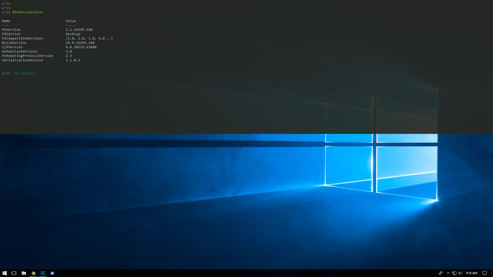

# ConEmu.xml

This is an export of my [ConEmu](https://conemu.github.io/) settings from https://www.learnpwsh.com/drop-down-powershell-console/

## Setup

1. __Download [ConEmu.xml](ConEmu.xml)__ or clone this repository.
2. __Open ConEmu__ and access the __settings__ <kbd>Win</kbd>+<kbd>Alt</kbd>+<kbd>P</kbd>.
3. Click "__Import__" at the bottom and __navigate to the XML file)).
4. Click "__Yes__" on the warning to overwrite your settings.
5. Click "__Save Settings__" to exit the settings pane.

## Result

